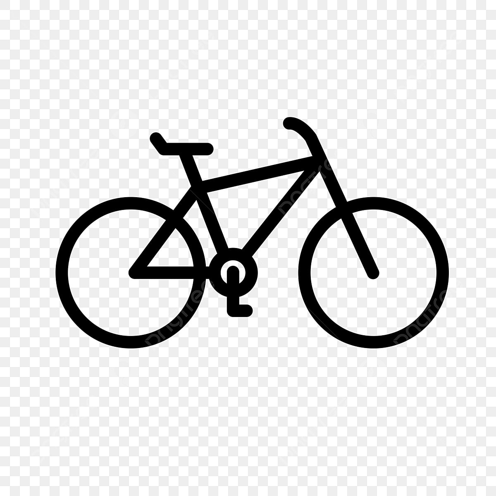

<!-- Improved compatibility of back to top link: See: https://github.com/othneildrew/Best-README-Template/pull/73 -->

<!--
*** Thanks for checking out the Best-README-Template. If you have a suggestion
*** that would make this better, please fork the repo and create a pull request
*** or simply open an issue with the tag "enhancement".
*** Don't forget to give the project a star!
*** Thanks again! Now go create something AMAZING! :D
-->

<!-- PROJECT SHIELDS -->
<!--
*** I'm using markdown "reference style" links for readability.
*** Reference links are enclosed in brackets [ ] instead of parentheses ( ).
*** See the bottom of this document for the declaration of the reference variables
*** for contributors-url, forks-url, etc. This is an optional, concise syntax you may use.
*** https://www.markdownguide.org/basic-syntax/#reference-style-links
-->
[![LinkedIn][linkedin-shield]][linkedin-url]

<!-- PROJECT LOGO -->
 

  

<h3 align="center">Bicycle Warehouse</h3>

  

    A mockup of a bicycle maintenance tracker list.    
    This project my first step in Web Development, practiced with the intention   of learning Vanilla HTML, CSS, JavaScript, and Node.js.  
 
    This project was started with a real-life bicycle workshop in mind (located in TLV) and hopefully will launch in the near future, once I get good enough at Web Development 😁
  

<!-- TABLE OF CONTENTS -->

  
Table of Contents

  <ol>
    <li>
      <a href="#about-the-project">About The Project</a>
      <ul>
        <li><a href="#built-with">Built With</a></li>
      </ul>
    </li>
    <!--
    <li>
      <a href="#getting-started">Getting Started</a>
      <ul>
        <li><a href="#prerequisites">Prerequisites</a></li>
        <li><a href="#installation">Installation</a></li>
      </ul>
    </li>
    -->
    <li><a href="#usage">Usage</a></li>
    <li><a href="#roadmap">Roadmap</a></li>
<!--    <li><a href="#contributing">Contributing</a></li>  -->
<!--    <li><a href="#license">License</a></li>  -->
    <li><a href="#contact">Contact</a></li>
    <!-- <li><a href="#acknowledgments">Acknowledgments</a></li> -->
  </ol>

<!-- ABOUT THE PROJECT -->
## About The Project
<!-- [![Product Name Screen Shot][product-screenshot]](https://example.com) -->

(<a href="#readme-top">back to top</a>)

### Built With

* ![HTML5][HTML5-shield]
* ![JavaScript][JS-shield]
* ![NodeJS][Nodejs-shield]

### What I Learned

I learned from scratch the following concepts:

1. JavaScript basics:
* Variables, Scopes, Hoisting, TDZ
* Closures
* IIFE
* Promises, fetch API, async await
* DOM structure
* Responsive Event-Based design
* The Event Loop

2. HTML5 and CSS basics
* Page structure
* HTML Forms
* Accessibility
* CSS Box Model 
* CSS Grid, CSS Flexbox
* CSS Animations
* CSS variables, units, functions

3. Node.js
* Modules
* Handling HTTP requests
* Basic server side routing and structure

  

(<a href="#readme-top">back to top</a>)

<!-- USAGE EXAMPLES -->
## Usage
<!--
Use this space to show useful examples of how a project can be used. Additional screenshots, code examples and demos work well in this space. You may also link to more resources.

_For more examples, please refer to the [Documentation](https://example.com)_
-->

(<a href="#readme-top">back to top</a>)

<!-- ROADMAP -->
## Roadmap

- [ ] Feature 1
- [ ] Feature 2
- [ ] Feature 3
    - [ ] Nested Feature
<!--
See the [open issues](https://github.com/github_username/repo_name/issues) for a full list of proposed features (and known issues).
-->

(<a href="#readme-top">back to top</a>)

<!-- CONTRIBUTING -->
## Contributing
<!--
Contributions are what make the open source community such an amazing place to learn, inspire, and create. Any contributions you make are **greatly appreciated**.

If you have a suggestion that would make this better, please fork the repo and create a pull request. You can also simply open an issue with the tag "enhancement".
Don't forget to give the project a star! Thanks again!

1. Fork the Project
2. Create your Feature Branch (`git checkout -b feature/AmazingFeature`)
3. Commit your Changes (`git commit -m 'Add some AmazingFeature'`)
4. Push to the Branch (`git push origin feature/AmazingFeature`)
5. Open a Pull Request
-->

(<a href="#readme-top">back to top</a>)

<!-- CONTACT -->
## Contact

Oren Pinkas

Project Link: [https://github.com/simpleffective/bicycle-warehouse](https://github.com/simpleffective/bicycle-warehouse)

(<a href="#readme-top">back to top</a>)

<!-- MARKDOWN LINKS & IMAGES -->
<!-- https://www.markdownguide.org/basic-syntax/#reference-style-links -->
[linkedin-shield]: https://img.shields.io/badge/-LinkedIn-black.svg?style=for-the-badge&logo=linkedin&colorB=555
[linkedin-url]: https://www.linkedin.com/in/oren-pinkas-b99466174/
[product-screenshot]: images/screenshot.png
[Next.js]: https://img.shields.io/badge/next.js-000000?style=for-the-badge&logo=nextdotjs&logoColor=white
[Next-url]: https://nextjs.org/
[React.js]: https://img.shields.io/badge/React-20232A?style=for-the-badge&logo=react&logoColor=61DAFB
[React-url]: https://reactjs.org/
[Vue.js]: https://img.shields.io/badge/Vue.js-35495E?style=for-the-badge&logo=vuedotjs&logoColor=4FC08D
[Vue-url]: https://vuejs.org/
[Angular.io]: https://img.shields.io/badge/Angular-DD0031?style=for-the-badge&logo=angular&logoColor=white
[Angular-url]: https://angular.io/
[Svelte.dev]: https://img.shields.io/badge/Svelte-4A4A55?style=for-the-badge&logo=svelte&logoColor=FF3E00
[Svelte-url]: https://svelte.dev/
[Laravel.com]: https://img.shields.io/badge/Laravel-FF2D20?style=for-the-badge&logo=laravel&logoColor=white
[Laravel-url]: https://laravel.com
[Bootstrap.com]: https://img.shields.io/badge/Bootstrap-563D7C?style=for-the-badge&logo=bootstrap&logoColor=white
[Bootstrap-url]: https://getbootstrap.com
[JQuery.com]: https://img.shields.io/badge/jQuery-0769AD?style=for-the-badge&logo=jquery&logoColor=white
[JQuery-url]: https://jquery.com 
[JS-shield]: https://img.shields.io/badge/JavaScript-grey?logo=javascript
[HTML5-shield]: https://img.shields.io/badge/HTML5-FFA500?logo=html5
[Nodejs-shield]: https://img.shields.io/badge/Node.js-lightgreen?logo=Node.js
